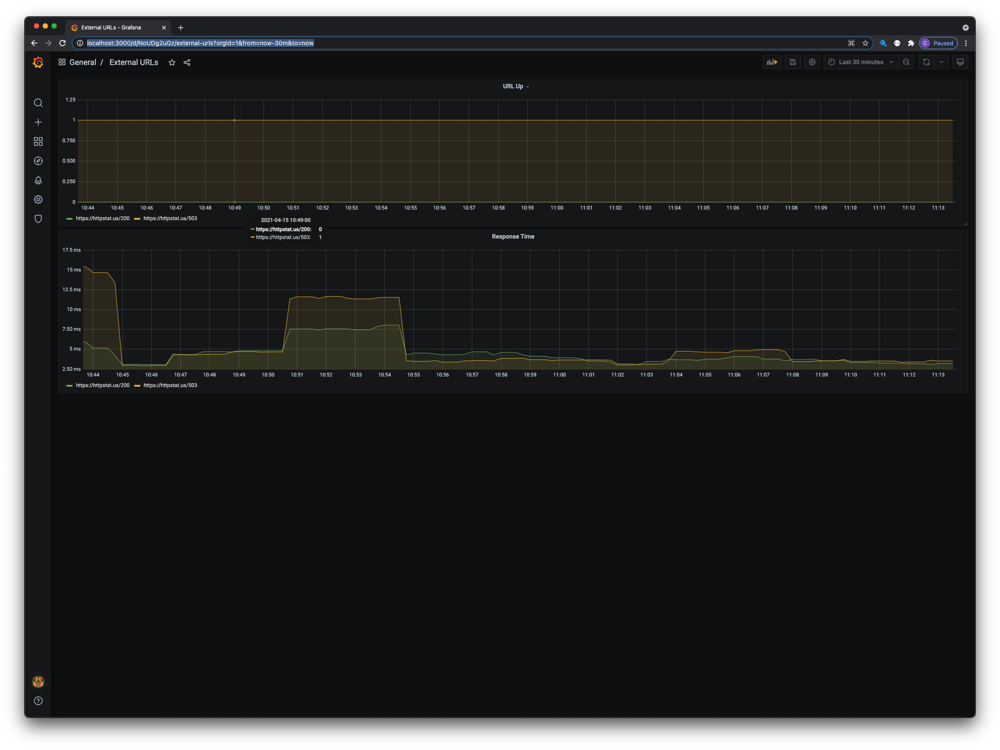

# vdpcr

A sample Prometheus Exporter

## Installation

Example kubernetes manifests are in the `deploy/manifests` directory and can be deployed as is. The manifests will
create a `vdpcr` namespace as well as a deployment and service. The deployment will add the `prometheus.io/scrape=true`
annotation which may work for you depending on your prometheus setup.

## Usage

Multiple targets can be polled by specifying the `--target` flag multiple times.

### CLI Reference

```shell
Usage of /vdpcr:
      --listen-address string   The address to listen on for HTTP requests. (default ":8080")
      --log-level string        log level to set. (debug, error, fatal, info, warn) (default "info")
      --target stringArray      target(s) to scrape. can be specified multiple times (default [https://httpstat.us/200,https://httpstat.us/503])
      --timeout duration        http client timeout (default 10s)
```

## Grafana Dashboard

There is a sample Grafana dashboard included in `extra/grafana/dashboard.json`

